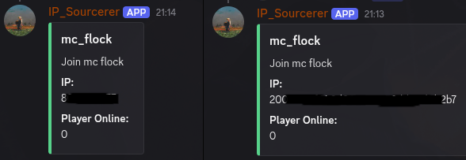

# DynamicIP_DiscordBot

This is a light-weight Discord Bot perfect for Game-Servers. The bot updates you about your current public **IPv4** of your Router or your **IPv6** address of your Server,
provided by your isp.
It's a really good alternative, if you don't want to buy a Domain-Name or use third-party services.

**command:**  /info



## Requirements

Requirements for your server, where your bot should running on.
- dpp libary - [install options](https://dpp.dev/installing.html)
- cmake - install or your package-manager (recommended) or build it from a [download](https://cmake.org/download/)

### Create your Discord Application-Token:
You need this API-Token to run your own but bot.
1. go to [https://discord.com/developers/applications]
2. sign in with your Discord Account or create a new one
3. click on the 'New Application' button on the top right (or where ever it is now)
4. create the Bot with a name you want
5. click on the 'Bot' tab, on the left > click 'Add Bot'
6. on your current screen should be now some personal configuration options like name, description, icon ... 
click on 'Reset Token' to create your Bot-Token

***Please don't share this token. You can store the token in a passwort-manager NOW. If you ever somehow compromise your current bot token or see your bot in danger, you can regenerate the token in the panel.*** 

### Get the Bot on your Discord server:
7. go to the [application page](https://discord.com/developers/applications) from Discord of your Bot (click on your Bot under 'My Applications')
8. open the tab 'OAuth2' > 'URL Generator'
9. tick the scope 'bot' and then tick the permissions: Manage Channels, Send Messages, Embed Links
10. Make sure the Integration type is on Guild Install
11. now you can copy and paste the Gnereated URL in your Browser and add it to your Server.

### Get the Bot running:

Execute the following set-up lines on your servers shell.
```bash
git clone https://github.com/kenkyo0/dynamicIP_discordBot.git
echo "..."
sleep 3
cd dynamicIP_discordBot && mkdir build
printf '{\n\t"server_name": "<your personal server>"\n\t"description": "..."\n\t"bot_token": "<Your BOT-TOKEN>",\n\t"server_id": <your server ID>,\n\t"gameserver": {\n\t\t"ipv6": true,\n\t\t"port": 25565\n\t}\n}' > config.json
cd build
cmake ../
cd ..
cmake --build build/ -j4
```
edit the config.json file with your specification.
You should have your BOT-TOKEN. You get the Discord Server ID by clicking 'right click' on your server name on the top left in discord, while being on your server.

**start your bot**
```bash
cd build/
make
./Dynamic_DiscordBot
```
If you are running the bot the first time or after changes, 
you might have to restart it one or a few times for being able to call commands.
(This is because of the Discord Web-Socket Update or the Linux TCP-Socket TIME-WAIT)

If everything went the right way, you should see your Bot online on Discord.
Check if the command /info is working.

If the command not works, check the bot permissions you've set.
